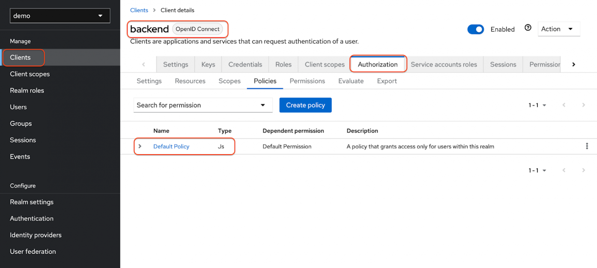

# Digital Territories Platform Data API

This is a Digital Territories Platform API to access and manipulate basic territories data.

## Running locally

### preparation

1. To install python dependencies
  run `poetry install`. You may also want to use `venv` before that.
2. Prepare a PostgreSQL Server to store the database.
3. Go to ./test_fastapi/db and run `alembic upgrade head` to apply migrations. Do not forget to set environment variables
  `DB_ADDR`, `DB_PORT`, `DB_NAME`, `DB_USER` and `DB_PASS` (or list them in .env file) if they are different from
  default values.

### configuring keycloak

1. From a terminal, enter the following command to start Keycloak: 

`docker run -p 8080:8080 -e KEYCLOAK_ADMIN=admin -e KEYCLOAK_ADMIN_PASSWORD=admin quay.io/keycloak/keycloak:24.0.2 start-dev`

2. Go to the [Keycloak Admin Console](http://localhost:8080) and log in with the username and password you created earlier.
3. Create realm **Test** in the top-left corner and go to it.
4. Click **Users** in the left-hand menu and **Add user**. Fill in the form with any values (fill in all the fields, otherwise the user will not be fully configured).
5. To set the initial password: click **Credentials** at the top of the page, fill in the **Set password** form with a password and toggle **Temporary** to **Off** so that the user does not need to update this password at the first login.
6. To secure the first application, you start by registering the application with your Keycloak instance:

    - click **Clients** and then **Create client**. 
    - **Client type**: OpenID Connect 
    - **Client ID**: urban_api
    - Click **Next**
    - Confirm that **Standard flow**, **Client authentication** and **Authorization** are enabled.
    - Click **Next**
    - Click **Save**

7. Create roles *admin* and *user* in **Realm roles**.
8. Go to the created user, click **Role mapping**, **Assign role** and select one of the roles you created earlier.

### launching

Run backend locally with `poetry launch_urban_api` or `poetry launch_urban_api --debug`.

You can open [localhost:8000](http://localhost:8000) (or different host/port if you configured it) to get a redirect to Swagger UI with endpoints list.

To get an access token (for example, you can import this into Postman):

`curl -X POST -d client_id=<client_id> -d client_secret=<secret> -d username=<user> -d password=<password> -d grant_type=password http://localhost:8080/realms/<realm>/protocol/openid-connect/token`

## Running in docker 

1. Create .env file by copying and editing env.example (repeat the same thing with db.env and keycloak.env).
2. Run the command `docker-compose up -d --build`
3. Go to the [Keycloak Admin Console](http://localhost:8080) and log in with the username and password that you specified earlier in KEYCLOAK_ADMIN and KEYCLOAK_ADMIN_PASSWORD.
4. Create realm, client, roles and users in the same way as in the paragraph **configuring keycloak**.
5. Delete **Default policy** in your client in the tab Authorization.
   

     
As picture

     
   

7. Go to the **Realm Settings** and choose **Partial export** in the top-right dropdown menu (Action).
   

     
As picture

     
   

8. As a result, we will get a large JSON file (real-export.json) containing the configuration of our realm. Copy it to the kc_data/import path (or any other, but specify it in docker-compose). You can also edit the client secret in the file before restarting docker.
9. Restart docker-compose: `docker-compose up -d --build`
10. You can open [localhost:8000](http://localhost:8000) (or different host/port if you configured it) to get a redirect to Swagger UI with endpoints list.

To get an access token (for example, you can import this into Postman):

`curl -X POST -d client_id=<client_id> -d client_secret=<secret> -d username=<user> -d password=<password> -d grant_type=password http://localhost:8080/realms/<realm>/protocol/openid-connect/token`
